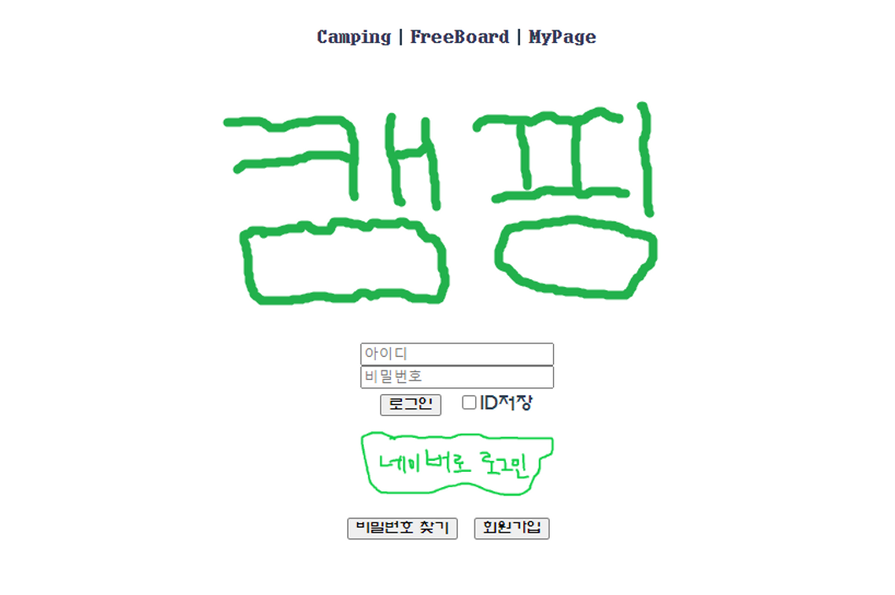

# Camping

 

### 📺 시연영상\

---
 

 
 

### 📖 상세내용

---

💡 JAVA, Spring, Vue.js, DB를 학습하고 이용하여 일주일간 빠르게 제작한 토이프로젝트입니다.   
팀인원은 총 두명이며 모두 백엔드를 담당하였습니다.   
공공데이터포털에서 주요 관광지  목록 조회 API를 이용하여 사이트를 만들었습니다.  

이 사이트는 캠핑에 관해 관심있는 사람들을 위한 컴퓨니티 사이트입니다.   
지도로 캠핑장을 조회해서 캠핑장의 위치와 정보를 알수있고,   
자유게시판에서 소통할 수 있습니다.   
또한 원하는 캠핑장을 즐겨찾기하여, 마이페이지에서 모아서 볼 수 있습니다.

 
 

### 📄주요 페이지

---

- **로그인 페이지**
    - 네이버 소셜로그인 또는 일반 회원가입이 가능합니다.
    - 비밀번호찾기를 누르면 입력한 이메일로 임시 비밀번호가 발급됩니다.
    
    
    
- **지도검색 페이지**
    
    
    - Kakao Map Api를 이용하여 캠핑장을 검색 할 수 있습니다.
    
    
    
- **캠핑장 상세페이지**
    
    
    
- **자유게시판 페이지**
    
    
    

 
 

### 📄프로젝트 **기술스택**

---

**SpringBoot**를 이용하여 **Rest API**를 구현하였습니다.

**MySQL**을 이용하여 데이터 관리를 하였으며, 이와 연동하기위해 **MyBatis**를 사용하였습니다.

소스코드 관리는 **Git**으로 하였으며 프론트엔드는 **Vue.js**를 이용하여 간단히 구현하였습니다.

 
 

### 👥팀원

---

- 윤민재 - 팀장, Back End
- 조성락 - 팀원, Back End
- 이경원 - 팀원, Front End

